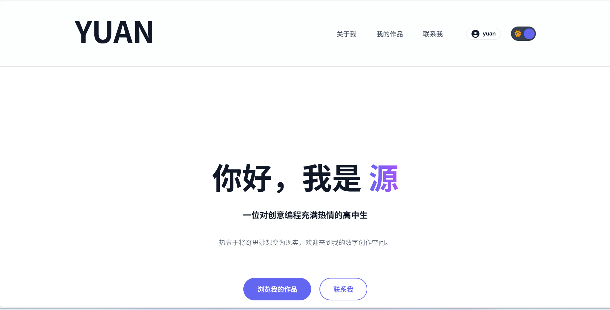

# Yuan的个人主页 (Personal Homepage)

这是一个基于原生 HTML、CSS 和 JavaScript 构建的现代化、响应式的个人主页模板。它拥有简洁的设计、深色/浅色模式切换以及专门用于展示作品的区域，非常适合作为开发者的个人数字名片。

**线上预览:** [https://www.betteryuan.cn/](https://www.betteryuan.cn/)

[](https://vercel.com/new/clone?repository-url=https%3A%2F%2Fgithub.com%2F<你的GitHub用户名>%2F<你的仓库名>)




---

## ✨ 主要功能 (Features)

-   **现代化设计**: 简洁、优雅的界面设计，突出核心内容。
-   **🎨 深色/浅色主题**: 内置一键切换的深色与浅色模式，适配不同用户的偏好。
-   **📱 完全响应式**: 无论在桌面、平板还是手机上，都能提供完美的浏览体验。
-   **🖼️ 作品展示区**: 使用卡片式布局清晰地展示你的项目作品。
-   **🚀 零配置部署**: 可以轻松地一键部署到 Vercel 平台。
-   **📝 SEO 友好**: 预设了基本的 SEO 元标签，有助于搜索引擎收录。

---

## 🛠️ 技术栈 (Tech Stack)

-   **HTML5**
-   **CSS3** (使用 CSS 变量实现主题切换)
-   **JavaScript (Vanilla)** (用于实现导航菜单、主题切换等交互功能)

---

## 🚀 本地开发与运行 (Getting Started)

1.  **安装依赖**:
    ```bash
    npm install
    ```

2.  **配置环境变量**:
    ```bash
    cp .env.example .env
    ```
    编辑 `.env` 文件，填入你的实际配置值。

3.  **启动开发服务器**:
    ```bash
    npm start
    ```
    服务器将在 http://localhost:3000 启动。

---

## 部署到 Vercel (Deployment)

这个应用使用 Node.js 后端，需要在 Vercel 上配置环境变量。

1.  **准备工作**:
    *   确保你已经将你的项目代码推送到了 GitHub 仓库。
    *   注册并登录 [Vercel](https://vercel.com/) 账号。

2.  **导入项目**:
    *   在 Vercel 的仪表盘页面，点击 `Add New...` -> `Project`。
    *   从列表中选择并导入你的 GitHub 仓库。

3.  **配置环境变量**:
    *   在项目设置中，添加以下环境变量（参考 `.env.example`）：
        - `SUPABASE_URL`
        - `SUPABASE_ANON_KEY`
        - `JWT_SECRET`
        - `PASSWORD_RESET_SECRET`
        - `BASE_URL`
        - `TURNSTILE_SECRET_KEY`
        - `RESEND_API_KEY`
        - `MAIL_FROM_ADDRESS`
        - `CRON_SECRET`

4.  **部署**:
    *   Vercel 会自动检测 `vercel.json` 配置。
    *   点击 `Deploy` 按钮开始部署。

5.  **完成**!
    *   部署完成后，你将获得一个 `.vercel.app` 域名。
    *   每次推送到主分支时会自动重新部署。

> **注意**: 确保所有必需的环境变量都已正确设置，否则应用无法正常运行。

---

## ✍️ 如何自定义 (Customization)

你可以轻松地修改网站内容，使其完全属于你。

-   **网站标题和描述**:
    *   打开 `index.html`，修改 `<head>` 标签内的 `<title>` 和 `<meta name="description">` 内容。

-   **个人信息**:
    *   在 `index.html` 中找到 `<!-- < 欢迎区 > -->` 和 `<!-- < 关于我 > -->` 的注释块，修改里面的文本内容为你自己的介绍。

-   **作品集**:
    *   在 `index.html` 中找到 `<!-- < 我的作品 > -->` 注释块。
    *   每个 `project-card` 代表一个项目。你可以修改其中的图标 (`<i class="...">`)、标题、描述和技术标签 (`<span class="tech-tag">`)。
    *   别忘了在 `<a>` 标签中填上你项目的实际链接。

-   **联系方式与社交链接**:
    *   在 `<!-- < 联系方式 > -->` 部分修改你的邮箱地址。
    *   在 `<!-- < 页脚 > -->` 部分，修改 `<a>` 标签中的 `href` 属性，链接到你的 GitHub、Bilibili 或其他社交媒体主页。

-   **头像/图标**:
    *   替换 `assets/img/favicon.ico` 文件为你自己的图标或头像。

---

## 📄 许可证 (License)

本项目采用 [MIT License](LICENSE) 授权。